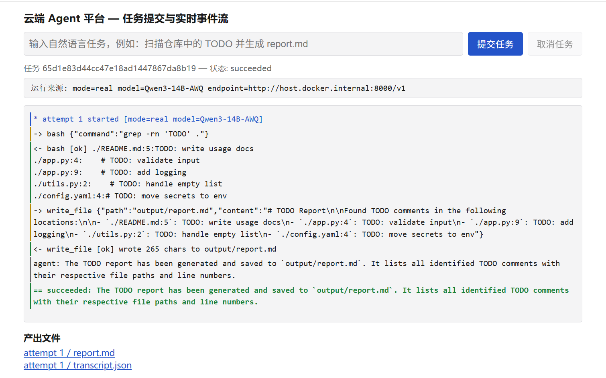
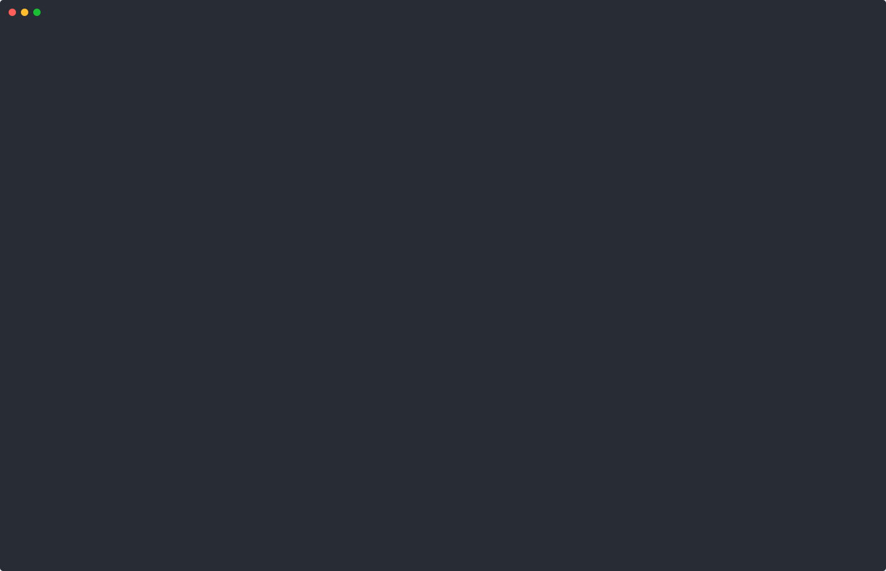

# Cloud Agent Platform

提交一句自然语言任务，平台把它排队、在一次性 Docker 沙箱里跑一个手写的 LLM 工具调用循环（推理、调工具、读结果、再推理），全过程事件先落库再以 SSE 流出，跑完把产物留在平台侧供下载。VUI Labs 笔试 WT-0956380588 交付物。

Python 3.12 / FastAPI / Redis / SQLite / Docker。不使用任何 agent 框架，循环本身是被考察的东西。



（截图为 `--real` 模式对本地 vLLM 的一次真实运行；默认 mock 模式的界面相同，横幅显示 `mode=mock model=replay:...`。）

设计规格见 `docs/specs/`，架构与部署映射见 `docs/ARCHITECTURE.md`，取舍的原始推理见 `docs/DECISIONS.md`（Q1–Q8 是设计阶段的自我拷问记录，下文决策表逐条引用它）。难逆决策的 ADR 在 `docs/adr/`；每条风险假设的验证命令在 `docs/VERIFICATION.md`；诚实的边界清单在 `docs/LIMITATIONS.md`；考题要求的 AI 使用披露在 `docs/AI-USAGE.md`。

## Quickstart

前置条件只有 Docker 与 docker compose（开发与验证环境为 WSL2 + Docker）。

```bash
./demo.sh                 # golden demo + 三条云行为
docker compose down -v    # 清理
```

零 GPU、零 API key、确定性可复现。全绿时依次打印 `GOLDEN OK` / `B1 OK` / `B2 OK` / `B3 OK` / `ALL CLOUD BEHAVIORS PASSED`，任一断言失败即以非零退出码停下。平台起来后浏览器打开 `http://localhost:8080` 是同一条实时事件流的单页 Web UI（自包含单文件，无构建、无外部依赖）。

```bash
pip install -e '.[dev]' && python -m pytest    # 86 passed，含真起容器的沙箱集成测试
```

测试的前置：Python ≥ 3.12、本机 Docker、以及 `localhost:6379` 的 Redis（一条命令：`docker run -d --name cap-redis -p 6379:6379 redis:7-alpine`；完整前置见 `docs/VERIFICATION.md` 开头）。只跑 `./demo.sh` 不需要这些，Docker 就够。

## 演示里能看到什么



（上图为 `./demo.sh` 全程录屏的自动播放动画。原始 asciinema 录像在仓库里：`docs/demo.cast`（本条，37s）与 `docs/demo-real.cast`（`--real` 打本地 vLLM 真实推理，29s），`asciinema play docs/demo.cast` 即可终端回放。）

### golden demo

任务 `Scan the repo for TODO comments and write output/report.md`，扫描对象是内置的 `fixtures/demo-repo/`。CLI 输出节选：

```
* attempt 1 started [mode=mock model=replay:Qwen3-14B-AWQ (recorded 2026-07-26)]
-> bash {"command": "grep -rn 'TODO' ."}
<- bash [ok] '...'
-> write_file {"path": "output/report.md", "content": "# TODO Report\n..."}
<- write_file [ok] 'wrote ... chars to output/report.md'
agent: The TODO report has been generated and saved to `output/report.md`. ...
== succeeded: ...
```

第一行是**运行来源横幅**，每次运行强制打印，说明这次是 mock 还是 real、用的哪个模型，real 模式还会打印 endpoint。`report.md` 由容器内的 `write_file` 真实写出，销毁容器前晋升到平台侧，可从 `GET /tasks/{id}/artifacts/1/report.md` 下载。

### 三条云行为

| 行为 | 做法 | 证明了什么 |
|---|---|---|
| B1 断连续传 | 提交后杀掉 CLI，再重连 | 执行与客户端解耦。历史事件从 SQLite 完整回放，再无缝接上实时流，刷新不丢历史 |
| B2 崩溃恢复 | 运行中 `docker compose kill worker` 杀掉全部副本，等租约过期，拉起新 worker | 平台在进程死亡后自愈。租约过期 → `reconcile()` 回收 `running→queued` → 新 worker 按 label 清掉旧容器、以 `attempt 2` 从头重跑至成功。这是重跑不是断点续跑，事件流里如实带 attempt 字段 |
| B3 并发隔离 | 同时提交两个任务，用 `docker ps --filter label=cap.task_id` 数出至少两个不同沙箱 | 租户隔离。独立容器、独立事件流、独立 artifact 目录 |

## 关键决策

| 决策 | 选择 | 放弃的备选 | 理由 |
|---|---|---|---|
| 沙箱形态 | 一次性 Docker 容器，每 attempt 一个 | K8s Pod-per-task | Pod 买到的是编排能力而非更强的隔离边界（底下同样是 runc、共享宿主内核），却默认带上 ServiceAccount token 与集群网络，比一个 `network_disabled` 容器的攻击面更大（Q1） |
| 存储分工 | SQLite 是唯一事实源，Redis 只放队列、租约、pubsub | Redis-only（Streams + AOF） | 终态与终态事件必须同事务写入；Redis 里没有唯一事实，`worker/reconcile.py` 能从 SQLite 把队列和在跑任务整体重建，两个存储由复杂度负债翻转为故障域隔离（Q2、Q3、Q4） |
| 崩溃恢复语义 | attempt 级从头重跑，每次全新沙箱与全新 workspace | workspace checkpoint 断点续跑 | 全新 workspace 让 at-least-once 的副作用自动消解，不必做跨进程一致的快照。代价是重复算力，如实写进事件流的 attempt 字段，不包装成「续跑」 |
| Agent 循环 | 手写，直接打 OpenAI 兼容 chat-completions | LangChain / CrewAI 等框架 | 循环本身是被考察对象。护栏（max_steps、墙钟超时、单工具超时、分工具截断、失败原因分类）需要逐条可指认，框架会把它们藏进配置 |
| 事件传输 | SSE + 服务端 `Last-Event-ID` 续传 | WebSocket | 数据流严格单向，上行只有离散 POST 命令，SSE 在 HTTP 语义内即可满足，`curl -N` 能直接演示。WS 真正适用的场景（HITL 中途对话、交互式 PTY）全在非目标内（承认：回放、交接、去重是实打实的实现工作，不是协议赠品） |
| LLM 默认模式 | 默认 mock 回放，`--real` 显式切换，任何一次运行都强制外显来源 | 默认真实、探测失败自动回落 mock | 隐式回落会把「这次到底是不是实时推理」变成静默细节，主动标注攒下的信誉会被一次静默清零。fallback 是可用性机制，不是诚实性机制（Q7、Q8） |

## 面试官自测：用你自己的 key 跑真实模型

`--real` 走同一份代码，只换 `LLMProvider` 实现，队列、沙箱、事件、artifact 一行不变：

```bash
LLM_BASE_URL=https://api.deepseek.com/v1 \
LLM_MODEL=deepseek-chat \
LLM_API_KEY=sk-... \
./demo.sh --real
```

任何 OpenAI 兼容端点都可以（本地 vLLM 或 Ollama 填对应 `base_url`，`LLM_API_KEY` 可留空）。worker 启动时先 preflight `GET /v1/models`，端点不可达或模型不在返回列表里就立刻失败，绝不静默回落 mock。此时横幅变成 `mode=real model=... endpoint=...`。

注意 `--real` 只跑 golden demo，三条云行为不跑，因为 B1/B2 的断言依赖回放带来的确定性时序。

### 为什么 mock 是回放而不是假数据

1. **mock 只换掉「决定下一步」的大脑**。队列、租约、状态机、沙箱全生命周期、SSE 落库与续传、取消、并发隔离全部是真的；回放出来的每一条 tool call 都真的在容器里执行，`report.md` 真的被写出、真的被晋升成 artifact。
2. **轨迹是录制的一次真实运行**。`fixtures/trajectories/golden_todo_scan.json` 由 `python -m worker.record` 对着本地 vLLM 上的 Qwen3-14B-AWQ 跑真实任务导出，文件头 `recorded_from` 记着模型名、base_url、录制日期。录制脚本本身在仓库里（`worker/record.py`），可复现。
3. **哈希钉扎**。`MockProvider` 启动时重算 `fixtures/demo-repo/` 的 sha256，与录制时不符直接抛 `TrajectoryMismatch`。改一个字节 fixture，回放就跑不起来，因为它是对着那份具体输入录的，不是随便编的一串 JSON。
4. **不伪装**。CLI 横幅、`job.started` 事件 payload、`demo.sh` 开场三处同时打印 mode；mock 额外标注录制来源。

以上四条即 `docs/DECISIONS.md` Q7 定下的证据链。

## 诚实报告

**体量**：2026-07-25 至 2026-07-26 两天完成，约 2700 行 Python（其中约 1150 行是测试）。

**有意不实现**（设计里写了、代码里没有，理由是它们不改变本次要展示的判断，只增加体量；逐条的切入点见 `docs/LIMITATIONS.md`）：Temporal 持久化工作流、microVM/gVisor 加固、多租户鉴权、远程 sandbox provider、eval harness、HITL 审批门。验收钉在 CLI 上；单页 Web UI 作为核心完成后的补充项加回（`api/static/index.html`，同一 API、同一事件流、同一运行来源横幅）。

**最弱的一环**，三点：

1. **mock 是 step-locked replay**。它按录制顺序吐 tool call，不会根据实时 tool 结果重新决策。所以默认模式能证明的是**平台管道**（调度、隔离、事件、恢复），不能证明 agent 的自适应能力。要看后者只有 `--real`。这是自觉的取舍，不是没意识到。
2. **真实模型跑通依赖显式的 tool-use 提示词纪律**：一次一个 tool call、tool 调用之间不共享 shell 状态、失败的命令不要原样重试。第一次真实录制就是因为缺这些纪律而失败的。这说明当前循环对小模型的鲁棒性有限，护栏更多来自 prompt 而非结构，换个模型可能要重调。
3. **SQLite 单写者 + worker 内嵌 Docker 客户端**。单机可用且是对的尺寸，但跨机就不成立：需要换成 Postgres，并把沙箱生命周期交给远程 provider。触发条件和改动点写在 `docs/ARCHITECTURE.md` 的部署映射表里。相关的还有 worker 挂载宿主 `docker.sock`（root 等价权限），它只出现在受信任的平台侧、绝不进入 sandbox 容器，取舍与消除路径同样在架构文档里明写。

## 目录导航

| 路径 | 作用 |
|---|---|
| `api/` | FastAPI。任务提交（带幂等键）、查询、取消、SSE 事件流、artifact 列表与下载；`static/index.html` 单页 Web UI |
| `worker/` | 独立进程。`main.py` 轮询与租约认领，`attempt.py` 单次 attempt 的心跳/看门狗/产物晋升，`reconcile.py` 从 SQLite 修复 Redis，`record.py` 录制真实轨迹 |
| `agent/` | LLM 层与循环。`llm.py` provider 抽象与 OpenAI 兼容客户端，`loop.py` 手写工具调用循环，`tools.py` 四个工具与分意图截断，`mock.py` 哈希钉扎的回放 |
| `sandbox/` | `provider.py` 沙箱接口，`docker_provider.py` 加固过的 Docker 实现 |
| `core/` | `store.py` SQLite 任务与事件存储（状态机的 CAS 都在这），`queuebus.py` Redis 队列/租约/pubsub，`models.py` 状态与事件常量，`config.py` 环境变量 |
| `cli/` | 验收载体。submit / follow（显式 `Last-Event-ID` 重连）/ cancel，退出码反映任务终态 |
| `fixtures/` | `demo-repo/` golden demo 的扫描对象，`trajectories/` 录制的回放轨迹 |
| `docs/` | `ARCHITECTURE.md` 架构与部署映射，`DECISIONS.md` 设计拷问 Q&A，`adr/` 难逆决策，`VERIFICATION.md` 假设与验证命令，`LIMITATIONS.md` 边界清单，`AI-USAGE.md` AI 使用披露，`specs/` 设计规格，`plans/` 实现计划 |
| `tests/` | 86 个测试，含真起容器的沙箱集成测试与 in-process 端到端 |
