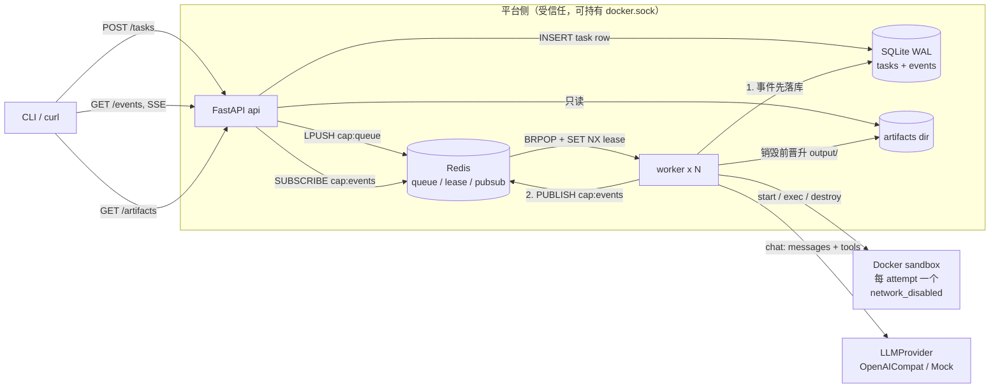

# 架构

本文档说明组件如何组装、一次任务如何流过系统、隔离在哪一层生效，以及这套本地 compose stack 原样上云时每个部件换成什么。设计规格见 `docs/specs/2026-07-25-cloud-agent-platform-design.md`，取舍推理见 `docs/DECISIONS.md`。

## 1. 组件图



四个进程（api、worker、redis、sandbox）只通过 Redis、SQLite、Docker API 交互，没有进程内共享状态。api 无状态可横向扩，worker 可加副本，认领由 Redis `SET NX` 串行化。**事件永远先写 SQLite 再 publish**，pubsub 只是让活着的连接快一点看到，唯一的历史在 SQLite。

## 2. 一次任务的生命周期

状态机：

```
queued ──claim (CAS)──> running ──finish (CAS)──> succeeded | failed | cancelled
   │                       │
   │                       └── reconcile: 租约消失且 attempt < max_attempts ──> queued
   └── cancel_queued (CAS) ──> cancelled
```

1. **提交**。`POST /tasks {prompt, idempotency_key?}` 调 `store.create_task()`，写入 `status=queued, attempt=0` 一行。`idempotency_key` 是 UNIQUE 列，同 key 重复提交返回既有任务体并把状态码降为 200，不新建。随后 `bus.enqueue()` 做 `LPUSH cap:queue`。
2. **并发闸门**。worker 主循环 `poll_once()` 每轮先跑 `reconcile()`，再看 `active_leases()`（`SCAN cap:lease:*` 计数）是否已达 `CAP_MAX_CONCURRENCY`（默认 2），达到就不认领。**活跃租约集合本身就是并发槽**，不另设计数器；worker 崩溃时槽位随 TTL 自然释放，不会泄漏。
3. **认领**。`BRPOP` 取出 task_id → `SET cap:lease:{id} {token} NX EX ttl` 抢租约（`SET NX` 天生把重复入队去重）→ `store.claim()` 做条件更新 `WHERE status='queued' AND attempt < max_attempts`，同时 `attempt+1`、写入 `worker_id`。`rowcount != 1` 就释放租约放弃，任务被取消、重试耗尽或被别人抢先都落在这一条上。
4. **清场**。`provider.remove_for_task(task_id)` 按 `cap.task_id` label 删掉上一次 attempt 崩溃遗留的容器，然后 `llm_factory()` 造一个新的 provider 实例（mock 回放持有游标，必须每 attempt 新建）。
5. **执行**。`run_attempt()` 起两个后台线程：
   - **heartbeat** 每 `lease_ttl/3` 续租，先校验 token 仍是自己的再 `EXPIRE`。工具阻塞（比如一条跑很久的 bash）期间租约不会掉。
   - **reaper** 每秒检查取消标志与墙钟 deadline，命中就直接 `sandbox.destroy()`。**销毁容器就是中断手段**：阻塞中的 exec 随即抛 `SandboxDied`，循环解开，reason 落在 `cancelled` 或 `timeout`。
   随后启动沙箱、把 fixture 目录打成 tar 拷进 `/workspace`、跑 `run_agent()`。循环每一步 emit 一个事件，走「先落库再 publish」。
6. **收尾**。`finally` 块里先 `download_artifacts()` 把 `/workspace/output/` 拷到平台侧 `artifacts/{task_id}/{attempt}/`，**再** `destroy()`。失败、取消、超时路径同样跑这一段，best-effort 抢救产物，保证演示不空手。transcript 也写进同一目录。
7. **终态写入的 CAS 保护**。`store.finish()` 执行 `UPDATE tasks SET status=... WHERE id=? AND status='running' AND attempt=?`，并在**同一个事务**里追加 `job.completed` / `job.failed` 事件。租约过期后任务已被别的 worker 接管、老 worker 才醒过来的场景下，老 worker 的 `rowcount=0`，既不改状态也不追加事件，不会出现「succeeded 但没有终态事件」或「两个 worker 各写一次终态」的脏账。最后 `release_lease()`（同样先校验 token）。
8. **回收路径**。Redis key 过期不触发任何回调，所以回收必须靠扫描。`reconcile()` 每轮做两件事：`running` 但 `lease_token()` 为空的任务，`attempt < max_attempts` 就 CAS 回 `queued` 并重新入队，否则以 `retries_exhausted` 置 failed；`queued` 但不在 `cap:queue` 列表里的任务补推。第二条让「Redis 是可从 SQLite 重建的缓存」在构造上成立，Redis 空库重启与 worker 崩溃走同一条恢复路径（见 DECISIONS.md Q3，集成测试 `tests/test_reconcile.py` 对此有断言）。
9. **取回**。`GET /tasks/{id}/artifacts` 列产物，`GET /tasks/{id}/artifacts/{attempt}/{name}` 下载。两者只读平台侧目录，**永不触碰容器**（容器此时早已销毁）；路径经 `realpath` 前缀校验防目录穿越。

## 3. 事件模型与 SSE

事件 schema 刚性，6 类，`{id, task_id, attempt, type, ts, payload}`，type ∈ `job.started` / `llm.message` / `tool.call` / `tool.result` / `job.completed` / `job.failed`。`id` 是 SQLite `AUTOINCREMENT`，全局单调，SSE 帧的 `id:` 字段直接用它。

**为什么先落库再流**。`store.append_event()` 先 INSERT 拿到自增 id，`bus.publish_event()` 才发 pubsub。顺序反过来的话，订阅者会先看到一个数据库里还不存在的 id，断线后按 `id > Last-Event-ID` 拉历史会拉空，那条事件永久消失。pubsub 是不保存的即时通道，它不承担持久性，只承担延迟。

**subscribe-then-replay 的交接顺序**。`api/main.py` 的 `_stream()` 先 `SUBSCRIBE` 频道，**再**读 `store.events_after(task_id, after)`。反过来（先读历史后订阅）的话，两步之间产生的事件既不在历史里也不在订阅里，是一个静默丢事件的窗口。先订阅则最坏只是重复。

**去重**。历史阶段记下最后一个 id（`seen`），进入实时循环后 `data["id"] <= seen` 一律丢弃，交接窗口的重叠部分被吃掉。

**续传**。服务端从 `Last-Event-ID` 请求头（或 `?after=` 查询参数）取起点。浏览器 `EventSource` 自动携带该头；CLI 的 `cli/main.py: follow_events()` 显式实现了同样的逻辑（记住最后一个 id，重连时带上，最多重连 30 次）。云行为 B1 的验收钉在 CLI 上，不依赖浏览器实现细节。

**收尾**。读到 `job.completed` / `job.failed` 即关闭流；历史里已含终态事件时读完直接返回，不进实时循环。空闲 15 秒发一个 `: keepalive` 注释帧维持连接。

## 4. 沙箱隔离

沙箱是安全边界。以下是 `sandbox/docker_provider.py` 中实际生效的加固项：

| 措施 | 实现 | 作用 |
|---|---|---|
| 丢弃全部 capability | `cap_drop=["ALL"]` | 容器内即使是 root 也没有内核特权 |
| 禁止提权 | `security_opt=["no-new-privileges"]` | setuid 二进制无法抬升权限 |
| 非 root 运行 | `user="agent"`（镜像里创建的 uid 1000） | 默认身份就不是 root |
| 进程数上限 | `pids_limit=256` | fork 炸弹拖不垮宿主 |
| 内存上限且禁用 swap | `mem_limit="512m"` + `memswap_limit="512m"` | 两者相等即无 swap 逃逸空间；超限被 OOM kill 后 `oom_killed()` 把它翻译成 `sandbox_oom` 失败原因，而不是一个含糊的「工具错误」 |
| CPU 上限 | `nano_cpus=1_000_000_000`（1 核） | 单任务吃不满宿主 |
| 断网 | `network_disabled=True` | golden demo 全程无网络。提示注入即使成功，数据也传不出去 |
| 工作区拷入而非挂载 | `put_archive()` 把 fixture 打 tar 送进 `/workspace` | 不 bind-mount 宿主任何目录，宿主文件系统对沙箱不可见 |
| 单工具超时 | 容器内包一层 `timeout -k 2 <n> bash -lc <cmd>` | 超时由容器内部执行，退出码 124 被识别为 `timed_out` |
| 身份 label | `cap.task_id` / `cap.attempt` | 既是并发隔离的可观测证据（B3 就是数这个 label），也是回收的依据 |
| 先晋升后销毁 | `worker/attempt.py` 的 `finally`：`download_artifacts()` 然后 `destroy()` | 失败与取消路径同样执行，产物不随容器一起消失 |
| 基于 label 的孤儿回收 | worker 启动时 `provider.gc(active_task_ids)`；认领到重入队任务时 `remove_for_task()` | 崩溃遗留的容器按 label 清掉，不靠人工，也不误删别的任务 |

**信任边界**：容器管安全，工具白名单不管。`bash` 在白名单里，意味着 `read_file` / `write_file` / `list_dir` 都能被它绕过，这是有意的，agent 需要一个开放能力入口。白名单负责的是另外三件事：协议健壮性（模型幻觉出 `search_web` 时回一个结构化的错误结果让它自救，而不是崩掉）、可观测性（结构化工具产生结构化事件，transcript 可读可回放，这是录制 mock 的存在基础）、以及按工具意图分化的超时与截断语义（`read_file` 保头部、`bash` 保尾部，因为报错在 shell 输出的末尾）。

爆炸半径以一次 attempt 为界：最坏情况是这次 workspace 被毁、任务失败或产出垃圾报告，宿主零影响，断网下连外传都做不到。内容级安全（输出过滤、HITL 审批门）不在本版威胁模型内。完整论证见 DECISIONS.md Q5、Q6。

## 5. 部署映射

| compose 服务 / 组件 | 本地实现 | 云上等价物 | 换的时候动什么 |
|---|---|---|---|
| `api` | 单个 uvicorn 容器 | 无状态容器组（ECS / Cloud Run / K8s Deployment）+ 负载均衡，按 QPS 扩缩 | 代码无需改动。LB 需关闭响应缓冲并放宽空闲超时，否则 SSE 会被切断 |
| `redis` | `redis:7-alpine` 容器 | 托管 Redis（ElastiCache / MemoryDB / 云厂商 Redis） | 只换 `CAP_REDIS_URL` |
| `worker` | `--scale worker=2` | 弹性伸缩池，按队列长度或活跃租约数扩缩 | 代码无需改动。认领靠 `SET NX` + store CAS，加副本即加并发 |
| Docker sandbox | 本机 dockerd | Firecracker microVM / E2B / 挂 gVisor 或 Kata 的 K8s Pod | 新增一个 `SandboxProvider` 实现，接口不变（见 §8） |
| SQLite | named volume 上的单文件 | Postgres（RDS / Cloud SQL） | 存储访问集中在 `core/store.py` 一处，事件契约与表结构不变，方言差异是已知的小成本。触发条件写死：**进程跨节点、或出现按任务的多写者的那一刻** |
| artifacts 目录 | named volume | 对象存储（S3 / OSS）+ 预签名 URL | 改 `worker/attempt.py` 的晋升目标与 API 的下载实现 |

**同一套 compose stack 原样跑在任意云 VM 上，就已经是云部署**。仓库刻意不引入任何只在本机成立的东西：没有 bind-mount 宿主用户数据，没有硬编码本机路径，配置全部走环境变量注入。

「云」在这里是架构属性而不是部署位置：执行与客户端解耦、任务有持久记录、进程可以死、副本可以加。README 里的三条云行为就是这句话的验收测试，它们在笔记本上跑通和在云上跑通是同一件事。

## 6. docker.sock 的让步

`docker-compose.yml` 里 worker 挂载了宿主的 `/var/run/docker.sock`。这是本仓库最大的一处安全让步，写在这里而不是藏起来。

- **有多严重**：能访问 docker socket 约等于宿主 root。持有它就可以起特权容器、挂宿主根目录。
- **边界在哪**：socket 只出现在**平台侧**的 worker 容器里，worker 跑的是本仓库的代码，不跑模型生成的任何东西。sandbox 容器（`cap-sandbox`）绝不挂载它，模型的每一条命令都只在那一侧执行。越权需要先攻破 worker 进程本身，而不是攻破 agent。
- **为什么仍然接受**：单机 demo 要求一条命令跑通，worker 必须能创建和销毁容器。引入 docker-socket-proxy 之类的中间层会增加评审的启动成本，而在 demo 规模下换不到实际收益。
- **云上怎么消掉**：把沙箱生命周期交给远程 provider（E2B 或 Firecracker 的控制 API），worker 只持有一个作用域受限的 API 凭据；或者跑在 K8s 上，worker 用一个只有单个 namespace 的 `pods` create / delete / exec 权限的 ServiceAccount，授权面从「宿主 root」降到「一个 namespace 的 Pod」。两条路都不需要改动 `SandboxProvider` 接口。

## 7. K8s 的定位

`K8sPodSandboxProvider` 是 **design-only 的映射，不是实现**，仓库里没有这个类。`SandboxProvider` 接口不用改就能装下它：`start` = 建 Pod 并等 Ready，`exec` = `pods/exec` 子资源，`read_file` / `write_file` / `download_artifacts` = tar over exec，`destroy` = 删 Pod，`gc` = 按 label 列 Pod 后删除。

不做的理由见 DECISIONS.md Q1，结论是：Pod 买到的是编排能力而不是更强的隔离边界，底下同样是 runc、共享宿主内核；真正升级隔离要靠 RuntimeClass 切 gVisor / Kata，这与用不用 K8s 正交（Docker 下同样可以 `--runtime=runsc`）。而 raw Pod 开箱默认自动挂载 ServiceAccount token、接入集群网络（可达其他 Pod、cluster DNS、云厂商 metadata 端点），要锁到本设计一个 `network_disabled` 就拿到的程度，需要逐项配置且部分依赖 CNI 实现。此外 sandbox-per-task 的高频建删对 etcd 与调度器不友好，生命周期也错配（K8s 原语偏 run-to-completion，本平台要的是「起一次、多轮交互式 exec、取产物、销毁」）。

因此在 §5 的映射表里，K8s 的正确位置是**平台自身**的底座（api 与 worker 以 Deployment 运行、HPA 扩缩），沙箱那一行的云上答案是 Firecracker / E2B 或加了强运行时的 Pod，不是 raw Pod。

## 8. 扩展性：加一个新东西要改哪些文件

### 加一个工具

1. `agent/tools.py`：在 `TOOL_SCHEMAS` 里加一条 `_fn(name, desc, props, required)`。`TOOL_NAMES` 由它派生，循环里的未知工具校验自动生效。
2. 同文件 `run_tool()` 加一个分支，返回 `{ok, exit_code, output, truncated}` 四件套，并选好截断方向：意图是「读文件开头」用 `truncate_head`，意图是「看命令为什么失败」用 `truncate_tail`。
3. 若它需要沙箱做新动作，先给 `sandbox/provider.py` 的 `SandboxHandle` 加抽象方法，再补齐每个实现（`sandbox/docker_provider.py` 与 `tests/fakes.py` 的 `FakeSandbox`）。
4. 测试模板：`tests/test_tools.py`。

`agent/loop.py`、事件 schema、API 均不需要改动。新增工具前先回答一个问题：它比经 `bash` 达成同一目的强在哪（DECISIONS.md Q6）。

### 加一个 LLM provider

1. 实现 `agent/llm.py` 里的 `LLMProvider` 抽象：
   - `describe() -> dict`，必须给出 `mode` / `model` / `base_url`。这是运行来源横幅、`job.started` payload 和 transcript 头的唯一数据源，不可省略。
   - `chat(messages, tools) -> ChatResult`，`tool_calls` 用 `ToolCall(id, name, arguments, parse_error)`。畸形 JSON 不要抛异常，填 `parse_error`，循环会把它当作可自救的工具错误回给模型。
2. 在 `worker/main.py: make_llm_factory()` 里按 `cfg.llm_mode` 加一个分支；需要新配置就加到 `core/config.py` 的 `Config` 与 `load_config()`。
3. 若有连通性前置检查，实现一个 `preflight()` 并在 factory 里调用，保持 fail fast、不静默回落的规矩（DECISIONS.md Q8）。

测试模板：`tests/test_llm.py`，用 httpx 的 `MockTransport` 打协议层，不联网。

### 加一个 sandbox provider

1. 实现 `sandbox/provider.py` 的两个抽象类：`SandboxProvider`（`start(task_id, attempt, workspace_src)` / `gc(active_task_ids)` / `remove_for_task(task_id)`）与 `SandboxHandle`（`exec` / `write_file` / `read_file` / `download_artifacts` / `destroy` / `oom_killed`）。
2. 在 `worker/main.py: main()` 里替换 `DockerSandboxProvider` 的构造。注意一处已知的死配置：`core/config.py` 里已有 `sandbox_backend` 字段（环境变量 `CAP_SANDBOX`），但 `worker/main.py` 目前**没有**按它分派，而是直接硬编码了 Docker 实现。加第二个 provider 时应顺手把这个分派补上。
3. 语义约束（不满足会破坏现有验收）：`start` 必须交付干净的 `/workspace` 与 `/workspace/output/`；`destroy` 必须幂等且在任何路径下可调用；实例必须带上 `cap.task_id` 与 `cap.attempt` 标识，否则 `gc` 与并发隔离的验收（数 label）失效；`exec` 在实例已消失时要抛 `SandboxDied`，这是取消与超时的中断机制所依赖的信号。
4. 测试模板：`tests/test_docker_sandbox.py` 是真起容器的集成测试。
