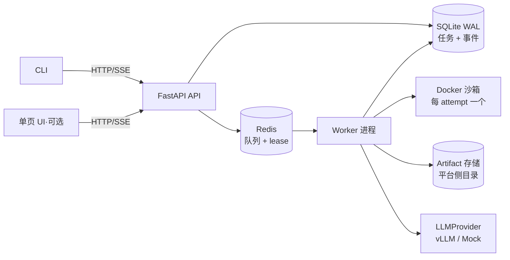

# Cloud Agent Platform — 设计规格

日期：2026-07-25 ｜ 版本：v1.1（经独立评审修订，见文末修订记录）｜ 状态：待最终确认 ｜ 语言约定：文档中文，代码/标识符/commit 英文

## 1. 背景与约束

VUI Labs（宇生月伴）笔试 WT-0956380588：构建一个 Cloud Agent Platform 演示——用户提交自然语言任务，平台在隔离环境中运行自主 agent（LLM 推理 + 工具调用循环）直至完成并返回结果。

- 截止：2026-07-30 23:59（北京时间）；时间预算：8~12 小时，分 2-3 天，README 如实申报用时
- 评估维度：问题拆解、架构取舍、工程质量、可扩展性、真实业务理解
- 考察点：① agent 编排与调度 ② 沙箱与隔离执行 ③ LLM 集成与工具调用 ④ 整体架构与可扩展性
- 运行环境：WSL2 + Docker 的笔记本；评审必须能在 10 分钟内跑通

## 2. 目标与非目标

**目标（必须实现）**：任务 API 与持久化任务模型；Redis 队列 + 独立 worker 的调度语义（attempt 级重跑）；每任务每 attempt 一个 Docker 沙箱；手写 LLM 工具调用循环；SSE 事件流（含 CLI 端断点续传）；CLI；三个云行为的可复现演示；docker-compose 一键启动；golden demo（扫描内置 fixture 仓库 TODO → 生成 report.md，`network=none`）。

**降级项**：单页 UI 为可选极简静态页（云行为验收不依赖它）；`git_url` 任务类型为设计项，仅当 D1 提前完成才实现（涉及网络策略切换与 SSRF 威胁面，见 §4.2）。

**非目标（只写设计，不实现）**：Temporal 持久化工作流、workspace checkpoint 断点续跑、gVisor/microVM 加固、多租户认证与计费、远程沙箱（E2B 等）、eval 体系、HITL 审批门。可选延伸（核心完成后才做）：真实云 VM 部署、真实 vLLM 模式录屏。

**"云"的定位**：云是架构属性而非部署位置。用三个可演示行为证明（§8），用部署映射表说明同一套栈原样上云（ARCHITECTURE.md），保留 ADR 论证"本地可跑的 demo 为什么代表云平台"。

## 3. 架构总览



四个组件独立进程，只通过 Redis / SQLite / HTTP 交互。API 无状态可横向扩展，worker 可加副本。SQLite 开 WAL + busy_timeout；写入纪律：API 只写任务提交行，某任务的事件只由持有其 lease 的 worker 写入（单写者，无跨进程行争用）；ARCHITECTURE.md 映射到 Postgres。

## 4. 组件设计

### 4.1 任务模型与调度（考察点①）

- 状态机：`queued → running → succeeded | failed | cancelled`，外加回收转移 **`running → queued`（lease 过期时）**。任务记录含时间戳、`attempt` 计数、`worker_id`、`max_attempts`（默认 2，超限转 failed(reason=retries_exhausted)）
- **attempt 语义（崩溃恢复的诚实版本）**：每次 attempt = 全新沙箱 + 全新 workspace + 从头执行的循环；事件流带 `attempt` 字段，恢复演示明说"重新执行"而非"断点续跑"。不做 workspace checkpoint（进非目标）。at-least-once 的副作用问题由"attempt 隔离的全新 workspace"消解——重跑不会污染上一次的半成品
- **Redis lease 即并发槽**：认领 = `SET lease:{task_id} {worker_token} NX EX ttl`；活跃 lease 数即在跑任务数，达到上限（默认 2）则不再认领。worker 崩溃 → lease TTL 自然过期 → 槽位自动释放 + 任务重入队，无需独立计数器
- **心跳与长阻塞工具**：工具 `exec` 阻塞期间由 worker 的独立心跳协程续约（校验 token 后续期）；终态写入用 compare-and-swap（校验自己仍持有 lease token），双 worker 竞态时后者写入失败
- 协作式取消：工具调用间隙检查取消标志；**取消同时强制终止沙箱**（destroy 容器即打断阻塞中的 exec）。任务墙钟超时由 worker 侧 watchdog 执行，同样走强制销毁路径
- `idempotency_key` 作用域：同 key 重复提交返回既有 task_id（HTTP 200 + 原任务体），不新建
- 禁止事项：无持久化记录的 fire-and-forget `asyncio.create_task`

### 4.2 沙箱（考察点②）

- `SandboxProvider` 接口：`start(job_id, attempt, image, resources, network_policy) / exec(cmd, timeout) / write_file / read_file / download_artifact / destroy`
- 实现 `DockerSandboxProvider`；E2B/gVisor/Firecracker 为设计项，接口预留
- **沙箱镜像**：本地预构建的 `cap-sandbox` 镜像（`python:3.12-slim` + git + bash + coreutils），compose 首次启动时 build，评审无需额外拉取
- 安全红线：绝不挂载 docker socket；`--cap-drop=ALL` + `--security-opt no-new-privileges`；非 root 用户运行；CPU/内存限额 + `--pids-limit`（防 fork 炸弹拖垮笔记本）；默认网络 `none`；工作区为平台管理的卷（不 bind-mount 宿主用户数据）
- **生命周期与孤儿回收**：容器打 `cap.task_id` / `cap.attempt` label；任务终态（含失败/取消/超时）先晋升 artifact 再 destroy；worker 认领到重入队任务时先按 label 清理旧 attempt 容器；worker/平台启动时执行一次 label 扫描 GC（清理崩溃遗留的容器与卷）
- **Artifact 晋升**：循环成功结束后、destroy 之前，将沙箱内 `/workspace/output/` 拷贝到平台侧 artifact 目录（按 task_id/attempt 归档）；`GET /tasks/{id}/artifacts` 只读平台存储，永不触碰容器。失败/取消路径 best-effort 晋升（能救多少救多少），保证 demo 不空手
- `git_url` 任务类型（设计项）：沙箱内 clone、该任务网络放开；威胁模型一句话——放开网络后 bash 可达内网，生产需 egress 白名单/网络代理，demo 范围内默认不启用该类型

### 4.3 LLM 集成层（考察点③）

- `LLMProvider` 接口：`chat(messages, tools) -> (text, tool_calls, usage)`，OpenAI 兼容协议
- `OpenAICompatProvider`：默认指向本地 vLLM 的 **Qwen3-14B-AWQ**（`base_url` 可配置）。兼容任何 OpenAI 协议端点。WSL2 下容器访问宿主：compose 配 `extra_hosts: ["host.docker.internal:host-gateway"]`（docker-ce 无 Docker Desktop 的自动 DNS）
- 工具调用：用 vLLM 原生解析，**parser 名以实测为准**（`hermes` 或 qwen3 系 parser，随 vLLM 版本变化）；启动参数需含 `--enable-auto-tool-choice --tool-call-parser <实测值>`。若原生解析不可用，改用 prompt 约定 JSON + 平台侧解析（二选一，不同时实现）。README 注明所用权重与 `--max-model-len`（Qwen3-14B 原生 32K，AWQ 部署可能配置更短）
- **`MockProvider` 回放语义（钉死）**：回放 = 对着**哈希钉扎的 fixture** 录制的一次真实运行轨迹，按 step 顺序吐出 `tool_calls`/文本，不依据实时 tool result 重新决策；fixture 内容 + 确定性命令保证轨迹可重现；UI/CLI/README 明确标注"回放模式（录制自真实 Qwen3 运行）"，不包装成实时推理。评审无 GPU 时跑通的是**平台**（队列/沙箱/SSE 全真实），模型智能由录制 transcript + 真实模式录屏证明。`demo.sh` 默认 mock
- 工具输出截断**按工具类型**：`read_file` 保头部+行号（TODO 扫描要的是文件前部），`bash` 保尾部，上限各 ~50KB
- 配置与密钥：`base_url`/模型名/超时全部经 compose 环境变量注入；事件流与 transcript 中禁止出现密钥类环境变量值

### 4.4 Agent 循环（考察点③）

手写循环，编排主干目标 ~200 行（护栏/IO 在协作模块，不为行数牺牲取消/重试/错误分类），仅用 OpenAI 兼容客户端，不引入 agent 框架（循环本身是被考察对象）：

```
loop (≤ max_steps):
    检查取消标志 → LLM.chat(messages, tools)
    无 tool_calls → 终局文本，任务成功
    有 → 逐个：发 tool.call 事件 → 白名单校验 → 沙箱内执行(带超时) → 按工具类型截断 → 发 tool.result 事件 → 回填 messages
超出 max_steps → 任务失败(reason=max_steps)
```

- 护栏：`max_steps=20`、任务墙钟超时、单工具超时、工具白名单（`bash` / `read_file` / `write_file` / `list_dir`）
- **信任边界声明**：容器是安全边界，工具白名单是审计/UX 分层——`bash` 的存在意味着文件工具可被绕过，这是有意设计（agent 能力），隔离靠容器 + 网络策略而非工具面
- transcript 全量落盘（调试与 AI-USAGE 证据）；失败原因区分：模型错误 / 工具错误 / 沙箱 OOM / 超时 / 步数超限 / 重试耗尽

### 4.5 API 与事件流

- `POST /tasks`（idempotency_key、任务描述）、`GET /tasks/{id}`、`GET /tasks/{id}/events`（SSE）、`POST /tasks/{id}/cancel`、`GET /tasks/{id}/artifacts`
- **事件 schema（刚性，6 类，实现期不加字段）**：`{id(自增), task_id, attempt, type, ts, payload}`，type ∈ `job.started / llm.message / tool.call / tool.result / job.completed / job.failed`；先持久化后投递；`usage` 累计入任务记录（计费扩展点）
- **SSE 回放→实时交接（防竞态）**：连接时先订阅 Redis pubsub，再读取历史（`id > Last-Event-ID`），按事件 id 去重合并后进入实时流——先订后读保证交接窗口不丢事件
- 断点续传：服务端支持 `Last-Event-ID` 头；浏览器 EventSource 自动重连自动携带；**CLI 显式实现重连携带逻辑**——云行为验收 §8.1 钉在 CLI 上，不依赖浏览器
- **决策：SSE 而非 WebSocket**——数据流严格单向（上行仅离散 POST 命令）；SSE 是 HTTP 语义内的成熟单向流，配合自实现的 Last-Event-ID 续传满足断连恢复（承认：回放/交接/去重是真实实现工作，非协议免费赠品）；`curl -N` 可直接终端演示。WS 的适用场景（HITL 中途对话、交互式 PTY、token 级语音流）全部在非目标内。事件契约与传输层解耦，未来加 WS 网关不动任务/事件模型。（转 ADR）

### 4.6 前端

- CLI（验收载体）：提交任务、跟随事件流打印（含断线重连续传）、退出码反映任务终态
- 单页 UI（可选极简）：任务表单 + 事件面板，原生 HTML+JS；砍单首位

## 5. 错误处理

- LLM 调用：指数退避重试（应对 vLLM 偶发超载/超时）
- 工具失败：`is_error` 回填给模型令其自救，不直接终止任务
- 沙箱异常：任务 failed + 明确 reason；容器无论如何销毁（先救 artifact）
- worker 崩溃：lease 过期 → `running→queued` → 新 worker 清理旧容器 → 新 attempt 从头执行
- 所有错误进入事件流（可观测性是产品的一部分）

## 6. 测试策略（TDD）

- 单元：状态机转换（含 `running→queued` 回收与 max_attempts）、lease token CAS、工具输出分类型截断、tool_calls 解析（含畸形 JSON）、幂等键、事件 schema 校验
- 集成：沙箱生命周期（创建→执行→晋升 artifact→销毁，含失败路径与孤儿 GC）
- e2e：MockProvider 跑通 golden demo（无 GPU 依赖，任何机器可复现）
- 单测运行：`pytest path/to/test.py::test_name`

## 7. 交付物结构

```
cloudagentperform/
├── README.md                 # 中文，决策先行；用时申报；砍掉了什么；最弱的部分
├── docs/
│   ├── ARCHITECTURE.md       # 架构图 + 部署映射表（compose 服务 → 云等价物）
│   ├── adr/                  # 3 个 MADR 极简 ADR（见下）
│   ├── DECISIONS.md          # 其余小决策的一行式 Y-statement
│   ├── VERIFICATION.md       # 三条云行为：假设 → 检验 → 可复现命令
│   ├── AI-USAGE.md           # 工具与范围 / 思考切分 / 关键提示词(含否决案例) / 验证方式
│   ├── LIMITATIONS.md        # 具体自曝弱点与修法
│   └── specs/                # 本文档
├── api/  worker/  agent/  sandbox/   # Python 3.12
├── web/(可选)  cli/  fixtures/demo-repo/
├── demo.sh                   # golden demo + 三个云行为
└── docker-compose.yml        # api + worker + redis（extra_hosts: host-gateway）
```

ADR（3 个）：① 本地可跑的 demo 为什么代表云平台；② SSE vs WebSocket；③ attempt 级重跑 vs workspace checkpoint 续跑。其余（手写循环 vs 框架、Docker vs 更强隔离、Redis vs Temporal）入 DECISIONS.md 一行式。

## 8. 云行为验收（demo.sh 必须演示，全部以 CLI 为载体）

1. **断连续传**：CLI 提交任务 → 杀掉 CLI → 重启 CLI 带 `Last-Event-ID` 重连 → 完整回放 + 续实时流（执行与客户端分离）
2. **worker 崩溃恢复**：任务运行中 `docker kill worker` → lease 过期 → 任务重入队 → 新 worker 清理旧容器、以 attempt=2 从头重跑至完成（平台韧性；话术明确"重新执行"）
3. **并发隔离**：两个任务同时提交 → 独立沙箱、独立事件流（租户隔离）

## 9. 时间计划

| 阶段 | 预算 | 内容 |
|---|---|---|
| D1 | ~5h | 脚手架 + 状态机/lease + 沙箱全生命周期(含GC/artifact) + agent 循环 + SSE 垂直切片跑通 |
| D2 | ~3h | 云行为演示脚本 + Mock 录制钉扎 + 测试补全 + 文档/ADR/AI-USAGE |
| D3 | 机动 | 录屏、抛光、可选：UI/git_url/真实 VM 部署 |

落后时的砍单顺序：UI（已默认降级）→ git_url（已默认设计项）→ 缩减文档篇幅；绝不砍 Docker 隔离、任务状态机、三个云行为。

## 10. 开放问题（实现前解决）

1. 用户本地 vLLM 启动参数实测：tool-call parser 名（hermes 或 qwen3 系）、endpoint、模型名、`--max-model-len`
2. `extra_hosts: host-gateway` 在用户 WSL2 docker 环境实测连通宿主 vLLM

## 修订记录

- v1.1（2026-07-25）：经 grok-4.5 独立评审后修订。主要变更：补 `running→queued` 回收转移与 attempt 级重跑语义；artifact 先晋升后销毁；Mock 回放语义钉死（step 锁定 + fixture 哈希钉扎 + 明确标注）；lease 即并发槽 + token CAS + 孤儿容器 label GC；SSE 交接竞态与 CLI 断点续传验收；沙箱加固补 no-new-privileges/非root/pids-limit/默认网络none；截断分工具类型；UI 与 git_url 预降级；SQLite 写入纪律；事件 schema 刚性化；ADR 压缩至 3 个。
- v1.0（2026-07-25）：初版（brainstorming 产出）。
