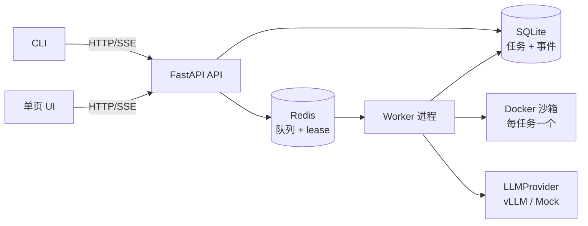

# Cloud Agent Platform — 设计规格

日期：2026-07-25 ｜ 状态：已批准 ｜ 语言约定：文档中文，代码/标识符/commit 英文

## 1. 背景与约束

VUI Labs（宇生月伴）笔试 WT-0956380588：构建一个 Cloud Agent Platform 演示——用户提交自然语言任务，平台在隔离环境中运行自主 agent（LLM 推理 + 工具调用循环）直至完成并返回结果。

- 截止：2026-07-30 23:59（北京时间）；时间预算：8~12 小时，分 2-3 天，README 如实申报用时
- 评估维度：问题拆解、架构取舍、工程质量、可扩展性、真实业务理解
- 考察点：① agent 编排与调度 ② 沙箱与隔离执行 ③ LLM 集成与工具调用 ④ 整体架构与可扩展性
- 运行环境：WSL2 + Docker 的笔记本；评审必须能在 10 分钟内跑通

## 2. 目标与非目标

**目标（必须实现）**：任务 API 与持久化任务模型；Redis 队列 + 独立 worker 的调度语义；每任务一个 Docker 沙箱；手写 LLM 工具调用循环；SSE 事件流；CLI + 单页 UI；三个云行为的可复现演示；docker-compose 一键启动；golden demo（扫描 fixture 仓库 TODO → 生成 report.md）。

**非目标（只写设计，不实现）**：Temporal 持久化工作流、gVisor/microVM 加固、多租户认证与计费、远程沙箱（E2B 等）、eval 体系、HITL 审批门、水平扩展的实际部署。可选延伸（核心完成后才做）：真实云 VM 部署、E2B 适配器。

**"云"的定位**：云是架构属性而非部署位置。用三个可演示行为证明（§8），用部署映射表说明同一套栈原样上云（ARCHITECTURE.md），保留一条 ADR 论证"本地可跑的 demo 为什么代表云平台"。

## 3. 架构总览



四个组件独立进程，只通过 Redis / SQLite / HTTP 交互。API 无状态可横向扩展，worker 可加副本——架构即"云的形状"，docker-compose 是其本地宿主。

## 4. 组件设计

### 4.1 任务模型与调度（考察点①）

- 状态机：`queued → running → succeeded | failed | cancelled`，含时间戳、attempt 计数、worker_id
- Redis lease + 心跳：worker 认领任务持有带 TTL 的 lease，循环中续心跳；lease 过期任务自动重新入队（at-least-once 语义，文档明示副作用幂等性边界）
- 全局并发上限（默认 2）；协作式取消（工具调用间隙检查取消标志，取消时销毁沙箱）；提交接受 `idempotency_key`
- 禁止事项：无持久化记录的 fire-and-forget `asyncio.create_task`

### 4.2 沙箱（考察点②）

- `SandboxProvider` 接口：`start(job_id, image, resources, network_policy) / exec(cmd, timeout) / write_file / read_file / download_artifact / destroy`
- 实现 `DockerSandboxProvider`；E2B/gVisor/Firecracker 为设计项，接口预留
- 安全红线：绝不挂载 docker socket；drop capabilities；CPU/内存限额；工作区为平台管理的卷（不 bind-mount 宿主用户数据）；任务结束（含失败/取消）必须销毁容器
- workspace 准备：(a) 内置 fixture 仓库复制进卷，网络策略 `none`；(b) 公开 git URL 在沙箱内 clone，该任务网络放开——网络策略是任务级属性

### 4.3 LLM 集成层（考察点③）

- `LLMProvider` 接口：`chat(messages, tools) -> (text, tool_calls, usage)`，OpenAI 兼容协议
- `OpenAICompatProvider`：默认指向本地 vLLM 的 **Qwen3-14B-AWQ**（`base_url` 可配置；容器内经 `host.docker.internal` 访问宿主机）。兼容任何 OpenAI 协议端点
- 工具调用：优先 vLLM 原生解析（需 `--enable-auto-tool-choice --tool-call-parser hermes`）；实现前验证实际启动参数，不可用则改用 prompt 约定 JSON + 平台侧解析（二选一，不同时实现）
- `MockProvider`：回放录制的真实任务 transcript，评审无 GPU/无端点时零配置跑通全链路（队列/沙箱/SSE 均为真实执行，仅 LLM 为回放）。`demo.sh` 默认 mock，README 说明切换真实模式
- 工具输出截断（保尾部约 50KB）后入上下文；Qwen3 上下文 32K，防爆策略必须存在

### 4.4 Agent 循环（考察点③）

手写循环，核心 ≤200 行，仅用 OpenAI 兼容客户端，不引入 agent 框架（循环本身是被考察对象）：

```
loop (≤ max_steps):
    检查取消标志 → LLM.chat(messages, tools)
    无 tool_calls → 终局文本，任务成功
    有 → 逐个：发 tool.call 事件 → 白名单校验 → 沙箱内执行(带超时) → 截断 → 发 tool.result 事件 → 回填 messages
超出 max_steps → 任务失败(reason=max_steps)
```

- 护栏：`max_steps=20`、任务墙钟超时、单工具超时、工具白名单（`bash` / `read_file` / `write_file` / `list_dir`）
- transcript 全量落盘（调试与 AI-USAGE 证据）；失败原因区分：模型错误 / 工具错误 / 沙箱 OOM / 超时 / 步数超限

### 4.5 API 与事件流

- `POST /tasks`（含 idempotency_key、可选 git_url、network_policy）、`GET /tasks/{id}`、`GET /tasks/{id}/events`（SSE）、`POST /tasks/{id}/cancel`、`GET /tasks/{id}/artifacts`
- 事件为 append-only 序列（自增 id）：`job.started / llm.message / tool.call / tool.result / job.completed / job.failed`，先持久化后投递
- SSE 连接先回放历史事件再接实时流；支持 `Last-Event-ID` 断点续传
- **决策：SSE 而非 WebSocket**——数据流严格单向（上行仅两个离散 POST 命令）；SSE 协议内置自动重连 + Last-Event-ID，配 append-only 事件表使"断连重连回放"云行为近乎免费；`curl -N` 可直接终端演示；WS 的适用场景（HITL 中途对话、交互式 PTY、token 级语音流）全部在非目标内。事件契约与传输层解耦，未来加 WS 网关不动任务/事件模型。（转 ADR）

### 4.6 前端

- CLI：提交任务、跟随事件流打印、退出码反映任务终态
- 单页 UI：原生 HTML+JS，任务表单 + 实时事件面板 + 结果展示，不做样式工程。UI 是首砍项

## 5. 错误处理

- LLM 调用：指数退避重试（应对 vLLM 偶发超载/超时）
- 工具失败：`is_error` 回填给模型令其自救，不直接终止任务
- 沙箱异常：任务 failed + 明确 reason；容器无论如何销毁
- worker 崩溃：lease 过期 → 重新入队 → 新 worker 接手
- 所有错误进入事件流（可观测性是产品的一部分）

## 6. 测试策略（TDD）

- 单元：状态机转换、lease 过期与重入队、工具输出截断、tool_calls 解析（含畸形 JSON）、幂等键
- 集成：沙箱生命周期（创建→执行→销毁，含失败路径与泄漏检查）
- e2e：MockProvider 跑通 golden demo（无 GPU 依赖，任何机器可复现）
- 单测运行：`pytest path/to/test.py::test_name`

## 7. 交付物结构

```
cloudagentperform/
├── README.md                 # 中文，决策先行；用时申报；砍掉了什么；最弱的部分
├── docs/
│   ├── ARCHITECTURE.md       # 架构图 + 部署映射表（compose 服务 → 云等价物）
│   ├── adr/000N-*.md         # MADR 极简 ADR，3~5 个
│   ├── VERIFICATION.md       # 风险假设 → 具体检验 → 可复现命令
│   ├── AI-USAGE.md           # 工具与范围 / 思考切分 / 关键提示词(含否决案例) / 验证方式
│   ├── LIMITATIONS.md        # 具体自曝弱点与修法
│   └── specs/                # 本文档
├── api/  worker/  agent/  sandbox/   # Python 3.12
├── web/  cli/  fixtures/demo-repo/
├── demo.sh                   # golden demo + 三个云行为
└── docker-compose.yml        # api + worker + redis
```

ADR 预定题目：① 为什么本地可跑的 demo 代表云平台；② SSE vs WebSocket；③ 手写 agent 循环 vs 框架；④ Docker 沙箱 vs 更强隔离；⑤ Redis+worker vs in-process/Temporal。

## 8. 云行为验收（demo.sh 必须演示）

1. **断连续传**：提交任务 → 客户端断开 → 重连 `GET /tasks/{id}/events` 完整回放并续实时流（执行与客户端分离）
2. **worker 崩溃恢复**：任务运行中 `docker kill worker` → lease 过期 → 任务重入队被新 worker 接走（平台韧性）
3. **并发隔离**：两个任务同时提交 → 独立沙箱、独立事件流（租户隔离）

## 9. 时间计划

| 阶段 | 预算 | 内容 |
|---|---|---|
| D1 | ~5h | 脚手架 + 状态机 + 沙箱 + agent 循环 + SSE 垂直切片跑通 |
| D2 | ~3h | 云行为演示脚本 + 测试补全 + 文档/ADR/AI-USAGE |
| D3 | 机动 | 录屏、抛光、可选真实 VM 部署 |

落后时的砍单顺序：先砍 Web UI，再砍 git-URL 任务类型；绝不砍 Docker 隔离与任务状态机。

## 10. 开放问题（实现前解决）

1. 用户本地 vLLM 的启动参数是否含 `--enable-auto-tool-choice --tool-call-parser hermes`（决定 4.3 的工具调用路线）；endpoint 地址与模型名待确认
2. WSL2 下容器访问宿主 vLLM 的地址（`host.docker.internal` 可用性）在脚手架阶段实测
